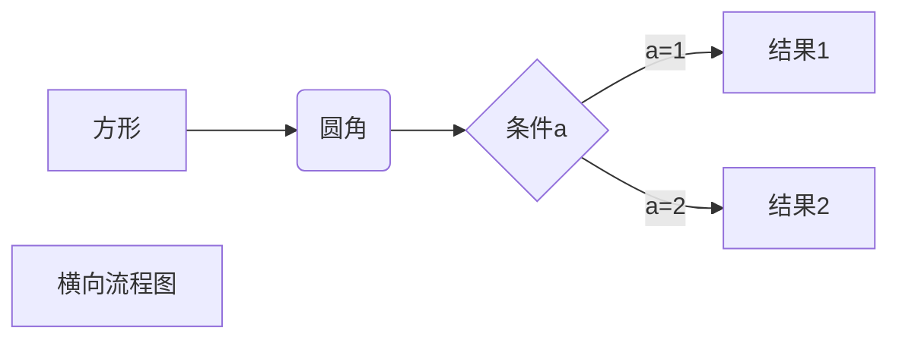

# 测试
### 代码高亮
```C
#include <stdio.h>
int main()
{
    printf("hello");

    return 0;
}
```

### 表格
| Item     | Value    | Qty  |
| :------- | :------- | :--- |
| Computer | 1600 USD | 5    |
| Phone    | 12 USD   | 12   |
| Pipe     | 1 USD    | 234  |

### 数学公式： $y=x^2$
### Inline math $\dfrac{\tfrac{1}{2}[1-(\tfrac{1}{2})^n]}{1-\tfrac{1}{2}} = s_n$

### 无序列表
- 列表1
  - 列表1.1
  - 列表1.2
- 列表2
- 列表3

> 最外层
>> 第一层嵌套
>>> 第二层嵌套

