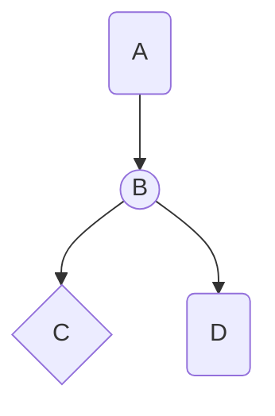

# 测试
### 代码高亮
```C
#include <stdio.h>
int main()
{
    printf("hello");

    return 0;
}
```
### To-do List
- [x]已完成项目1
 - [x]已完成事项2
 - [x]已完成事项2
- []待办事项1
- []待办事项2

### 流程图


```mermaid
graph TD
    A(A) -->B((B))
    B -->C{C}
    B -->D(D)
```

### 序列图
